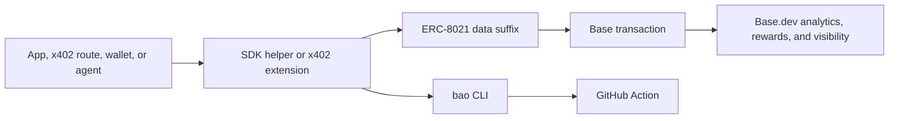

# Base Attribution OS

[](https://github.com/horn111/base-attribution-os/actions/workflows/ci.yml)
[](LICENSE)
[](https://www.typescriptlang.org/)
[](https://docs.base.org/apps/builder-codes/builder-codes)
[](https://github.com/horn111/base-attribution-os)

Add, validate, and enforce Base Builder Code attribution across x402, viem,
wagmi, wallets, agents, and CI.

Builder Codes are powerful, but attribution fails silently. Base Attribution OS
turns attribution into a development workflow: SDK helpers append ERC-8021
suffixes for supported transaction clients, x402-aware scans enforce official
Builder Code extensions, the CLI validates calldata and transactions, and CI
catches missing Builder Codes before code ships.

Update 4 adds x402 Builder Code CI support. Official x402 extensions make
attribution native for paid HTTP flows; BAO checks that buyer and seller paths
keep those extensions before code ships.



Built by [horn111](https://github.com/horn111). This is an independent OSS
project for the Base ecosystem.

Live demo: [base-attribution-os.vercel.app](https://base-attribution-os.vercel.app)

Verified proof Builder Code: `bc_vwmzy653`.

Onchain proof: [docs/onchain-proof.md](docs/onchain-proof.md) records a verified
Base mainnet transaction attributed with BAO's Builder Code.

Do not use BAO's proof code in your app. Replace all example codes with your own
Builder Code from Base.

Companion project:
[Base Game Migration](https://github.com/horn111/base-game-migration) may use
BAO as the Builder Code attribution layer for game migration flows. This
repository stays focused on attribution, validation, and CI.

## Why this exists

Base Builder Codes connect onchain activity to the apps, wallets, and agents
that create it. That attribution can affect analytics, rewards readiness,
leaderboard surfaces, and ecosystem visibility.

The problem: most teams only notice missing attribution after transactions are
already live.

| Before                        | After                                             |
| ----------------------------- | ------------------------------------------------- |
| Builder Code lives in docs    | Builder Code lives in SDK config and CI           |
| Missing suffix fails silently | PR fails before deploy                            |
| Manual calldata inspection    | `bao check-calldata` and `bao check-tx`           |
| One-off app setup             | Shared checks for SDKs, x402, wallets, and agents |

Official context:

- [Base Builder Codes](https://docs.base.org/apps/builder-codes/builder-codes)
- [Base App Developers](https://docs.base.org/apps/builder-codes/app-developers)
- [Base Wallet Developers](https://docs.base.org/apps/builder-codes/wallet-developers)
- [Base Agent Developers](https://docs.base.org/apps/builder-codes/agent-developers)
- [Base Rewards](https://docs.base.org/apps/growth/rewards)
- [Coinbase x402 Builder Codes](https://docs.cdp.coinbase.com/x402/builder-code.skill)
- [Dune EIP-8021 parser](https://docs.dune.com/query-engine/Functions-and-operators/eip-8021)
- [base/builder-codes](https://github.com/base/builder-codes)

## Why Base should care

Attribution only creates ecosystem value when teams can ship it reliably.
Builder Codes, x402 paid HTTP flows, app discovery, rewards readiness, and
analytics all depend on the same practical question: did the transaction path
actually carry the expected attribution?

Base Attribution OS makes that question testable before deploy. It gives teams
SDK helpers where BAO owns the suffix, scanner checks where official SDKs own
the integration, and CI output that Base ecosystem reviewers can inspect.

## Complementary tools

Base docs link to the
[Builder Code Validation](https://builder-code-checker.vercel.app/) tool for
manual post-transaction checks. BAO does not replace that checker. It complements
it by moving attribution checks earlier in the lifecycle:

| Tool                         | Best for                                               |
| ---------------------------- | ------------------------------------------------------ |
| Builder Code Validation tool | Manual validation after a transaction already exists   |
| BAO                          | SDK helpers, local scans, CI enforcement, and tx proof |

Use the checker when you have a transaction hash. Use BAO when you want the code
path to fail before an unattributed transaction ships.

## Grant-ready status

| Current shipped surface            | Next funded milestone                |
| ---------------------------------- | ------------------------------------ |
| Core ERC-8021 helpers              | Public `v0.1.0` package release      |
| viem, wagmi, ethers helpers        | Three pilot integrations             |
| `bao` encode/decode/check/scan CLI | Public attribution fixture set       |
| GitHub Action wrapper              | Dune attribution replay templates    |
| x402 buyer/seller scanner support  | Measurement report for Base builders |
| Vercel Scanner playground          | Wallet and agent pilot fixtures      |
| Verified onchain proof tx          | Dune attribution replay templates    |

Grant packet: [docs/grant-brief.md](docs/grant-brief.md). Supporting materials
live in [docs/grant](docs/grant).

## 60-second quickstart

Base Attribution OS is currently pre-release. Clone and build the workspace
locally:

```bash
git clone https://github.com/horn111/base-attribution-os.git
cd base-attribution-os
pnpm install
pnpm build
```

The package names below are the intended npm interface for the first public
package release:

```bash
pnpm add @base-attribution-os/core @base-attribution-os/viem
# or, for ethers projects:
pnpm add @base-attribution-os/core @base-attribution-os/ethers
pnpm add -D @base-attribution-os/cli
```

Encode a Builder Code suffix:

```bash
node packages/cli/dist/index.js encode --code bc_abc123
```

Use it with viem:

```ts
import { builderCodeDataSuffix } from "@base-attribution-os/viem";

const dataSuffix = builderCodeDataSuffix("bc_abc123");

await walletClient.sendTransaction({
  account,
  to,
  value,
  data: "0x",
  dataSuffix,
});
```

Use it with ethers:

```ts
import { withEthersAttribution } from "@base-attribution-os/ethers";

await signer.sendTransaction(
  withEthersAttribution(
    {
      to,
      value,
      data: "0x",
    },
    { codes: ["bc_abc123"] },
  ),
);
```

Use it with wagmi:

```tsx
import { useAttributionSuffix } from "@base-attribution-os/wagmi";

export function MintButton() {
  const dataSuffix = useAttributionSuffix({ codes: ["bc_abc123"] });

  return (
    <button
      onClick={() =>
        writeContract({
          address,
          abi,
          functionName: "mint",
          args: [],
          dataSuffix,
        })
      }
    >
      Mint
    </button>
  );
}
```

Validate calldata:

```bash
node packages/cli/dist/index.js check-calldata --calldata 0x... --expect bc_abc123
```

Validate a transaction:

```bash
node packages/cli/dist/index.js check-tx \
  --hash 0x... \
  --rpc-url https://mainnet.base.org \
  --expect bc_abc123
```

Fail PRs that remove attribution:

```yaml
name: Validate Attribution

on:
  pull_request:

jobs:
  attribution:
    runs-on: ubuntu-latest
    steps:
      - uses: actions/checkout@v4
      - uses: horn111/base-attribution-os/packages/github-action@main
        with:
          builder-code: bc_abc123
          paths: "src,app,packages,examples"
          profile: "ci"
          fail-on-missing: "true"
```

## Packages

| Package                              | Purpose                                   | Install                                | Maturity |
| ------------------------------------ | ----------------------------------------- | -------------------------------------- | -------- |
| `@base-attribution-os/core`          | ERC-8021 encode, decode, append, validate | `pnpm add @base-attribution-os/core`   | MVP      |
| `@base-attribution-os/viem`          | viem `dataSuffix` and client helpers      | `pnpm add @base-attribution-os/viem`   | MVP      |
| `@base-attribution-os/wagmi`         | wagmi config and hook helpers             | `pnpm add @base-attribution-os/wagmi`  | MVP      |
| `@base-attribution-os/ethers`        | ethers transaction and signer helpers     | `pnpm add @base-attribution-os/ethers` | MVP      |
| `@base-attribution-os/cli`           | `bao` validator CLI                       | `pnpm add -D @base-attribution-os/cli` | MVP      |
| `@base-attribution-os/github-action` | CI enforcement wrapper                    | GitHub Action                          | MVP      |

NPM packages are not published yet. Until the first release, use the workspace
directly or pin the GitHub Action to `@main`.

## CLI

```bash
bao encode --code bc_abc123
bao decode --calldata 0x...
bao check-calldata --calldata 0x... --expect bc_abc123
bao check-tx --hash 0x... --rpc-url https://mainnet.base.org --expect bc_abc123
bao scan-repo --path . --builder-code bc_abc123 --profile ci
```

When running from this repository before npm publish, replace `bao` with
`node packages/cli/dist/index.js`.

`scan-repo` classifies common transaction entrypoints across viem, wagmi,
ethers, wallet, agent, and x402 flows. Findings include the file, line,
transaction family, and marker that triggered the check.

Profiles let teams choose the right enforcement level:

- `local`: report findings while teams are wiring attribution in.
- `ci`: fail obvious missing or wrong Builder Code usage.
- `strict`: require the expected Builder Code or suffix in candidate files.

## x402 Builder Codes in CI

x402 Builder Codes make attribution native for paid HTTP flows on Base. BAO does
not replace the x402 SDK, execute payments, or talk to a facilitator. It checks
that the official x402 Builder Code hooks stay present in the code paths teams
ship.

The scanner looks for buyer/client paths such as `x402Client`,
`wrapFetchWithPayment`, `BuilderCodeClientExtension`, and `registerExtension`.
It also checks seller/resource-server paths such as `paymentMiddleware`,
`x402ResourceServer`, `BUILDER_CODE`, and `declareBuilderCodeExtension`.

Use `ci` while teams wire environment-driven Builder Codes, then move critical
payment paths to `strict` when the expected literal code or suffix should be in
the candidate file.

See [docs/x402-builder-codes.md](docs/x402-builder-codes.md) for examples and
limitations.

## Use cases

- dApp teams: make Builder Codes part of the transaction helper layer.
- x402 builders: keep buyer and seller attribution extensions in paid HTTP
  paths.
- Smart wallet teams: enforce attribution around `sendCalls` and batched flows.
- Agent builders: keep autonomous transaction flows visible in Base analytics.
- Growth engineers: create a repeatable checklist for Base.dev readiness.
- Base ecosystem teams: review integration PRs with automated attribution checks.

## Roadmap

- MVP: core, viem, wagmi, CLI, GitHub Action, examples, README.
- Shipped: scanner v0.2 for viem, wagmi, wallet, and agent transaction flows.
- Shipped: ethers adapter and scanner profiles for stricter CI.
- Shipped: Vercel scanner playground.
- Update 4: x402 Builder Codes CI support for buyer and seller payment paths.
- Next: wallet middleware for `sendCalls` and smart account frameworks.
- Next: public x402 pilot fixtures and stricter real-world scan cases.
- Next: Dune query templates for attributed transaction replay.
- Next: local dashboard, alerts, and shareable progress cards for X.
- Later: pilot integrations, public leaderboard screenshots, and grant reports.

See [docs/roadmap.md](docs/roadmap.md) for the working roadmap.

## Social proof hooks

- Public pilots: `0/3` target for the first launch cycle.
- Attributed transaction examples: collecting first verified cases.
- Integration requests: open an issue with your framework, wallet, or agent stack.

## Contributing

Start with [CONTRIBUTING.md](CONTRIBUTING.md), then pick one of these:

- Add a framework example that uses a real transaction shape.
- Improve scanner detection for a wallet, agent, or SDK.
- Submit a public attribution case with calldata or a transaction hash.
- Tighten the README so a Base team can integrate in under ten minutes.

## Disclaimer

Base Attribution OS is not affiliated with Coinbase or Base. It is open-source
developer tooling designed to help teams implement and verify Builder Code
attribution.
