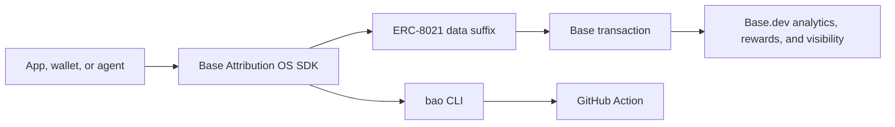

# Base Attribution OS

[](https://github.com/horn111/base-attribution-os/actions/workflows/ci.yml)
[](LICENSE)
[](https://www.typescriptlang.org/)
[](https://docs.base.org/apps/builder-codes/builder-codes)
[](https://github.com/horn111/base-attribution-os)

Add, validate, and enforce Base Builder Code attribution across viem, wagmi,
wallets, agents, and CI.

Builder Codes are powerful, but attribution fails silently. Base Attribution OS
turns attribution into a development workflow: SDK helpers append the ERC-8021
suffix, the CLI validates calldata and transactions, and CI catches missing
Builder Codes before code ships.



Built by [horn111](https://github.com/horn111). This is an independent OSS
project for the Base ecosystem.

## Why this exists

Base Builder Codes connect onchain activity to the apps, wallets, and agents
that create it. That attribution can affect analytics, rewards readiness,
leaderboard surfaces, and ecosystem visibility.

The problem: most teams only notice missing attribution after transactions are
already live.

| Before                        | After                                                |
| ----------------------------- | ---------------------------------------------------- |
| Builder Code lives in docs    | Builder Code lives in SDK config and CI              |
| Missing suffix fails silently | PR fails before deploy                               |
| Manual calldata inspection    | `bao check-calldata` and `bao check-tx`              |
| One-off app setup             | Shared adapters for viem, wagmi, wallets, and agents |

Official context:

- [Base Builder Codes](https://docs.base.org/apps/builder-codes/builder-codes)
- [Base App Developers](https://docs.base.org/apps/builder-codes/app-developers)
- [Base Wallet Developers](https://docs.base.org/apps/builder-codes/wallet-developers)
- [Base Agent Developers](https://docs.base.org/apps/builder-codes/agent-developers)
- [Base Rewards](https://docs.base.org/apps/growth/rewards)
- [Dune EIP-8021 parser](https://docs.dune.com/query-engine/Functions-and-operators/eip-8021)
- [base/builder-codes](https://github.com/base/builder-codes)

## 60-second quickstart

Install the SDK and CLI:

```bash
pnpm add @base-attribution-os/core @base-attribution-os/viem
pnpm add -D @base-attribution-os/cli
```

Encode a Builder Code suffix:

```bash
pnpm bao encode --code bc_abc123
```

Use it with viem:

```ts
import { builderCodeDataSuffix } from "@base-attribution-os/viem";

const dataSuffix = builderCodeDataSuffix("bc_abc123");

await walletClient.sendTransaction({
  account,
  to,
  value,
  data: "0x",
  dataSuffix,
});
```

Use it with wagmi:

```tsx
import { useAttributionSuffix } from "@base-attribution-os/wagmi";

export function MintButton() {
  const dataSuffix = useAttributionSuffix({ codes: ["bc_abc123"] });

  return (
    <button
      onClick={() =>
        writeContract({
          address,
          abi,
          functionName: "mint",
          args: [],
          dataSuffix,
        })
      }
    >
      Mint
    </button>
  );
}
```

Validate calldata:

```bash
pnpm bao check-calldata --calldata 0x... --expect bc_abc123
```

Validate a transaction:

```bash
pnpm bao check-tx \
  --hash 0x... \
  --rpc-url https://mainnet.base.org \
  --expect bc_abc123
```

Fail PRs that remove attribution:

```yaml
name: Validate Attribution

on:
  pull_request:

jobs:
  attribution:
    runs-on: ubuntu-latest
    steps:
      - uses: actions/checkout@v4
      - uses: horn111/base-attribution-os/packages/github-action@v0
        with:
          builder-code: bc_abc123
          paths: "src,app,packages,examples"
          fail-on-missing: "true"
```

## Packages

| Package                              | Purpose                                   | Install                                | Maturity |
| ------------------------------------ | ----------------------------------------- | -------------------------------------- | -------- |
| `@base-attribution-os/core`          | ERC-8021 encode, decode, append, validate | `pnpm add @base-attribution-os/core`   | MVP      |
| `@base-attribution-os/viem`          | viem `dataSuffix` and client helpers      | `pnpm add @base-attribution-os/viem`   | MVP      |
| `@base-attribution-os/wagmi`         | wagmi config and hook helpers             | `pnpm add @base-attribution-os/wagmi`  | MVP      |
| `@base-attribution-os/cli`           | `bao` validator CLI                       | `pnpm add -D @base-attribution-os/cli` | MVP      |
| `@base-attribution-os/github-action` | CI enforcement wrapper                    | GitHub Action                          | MVP      |

## CLI

```bash
bao encode --code bc_abc123
bao decode --calldata 0x...
bao check-calldata --calldata 0x... --expect bc_abc123
bao check-tx --hash 0x... --rpc-url https://mainnet.base.org --expect bc_abc123
bao scan-repo --path . --builder-code bc_abc123
```

`scan-repo` classifies common transaction entrypoints across viem, wagmi,
wallet, and agent flows. Findings include the file, line, transaction family,
and marker that triggered the check. It is intentionally conservative: it flags
obvious missing or wrong Builder Code usage and gives maintainers a CI guardrail.

## Use cases

- dApp teams: make Builder Codes part of the transaction helper layer.
- Smart wallet teams: enforce attribution around `sendCalls` and batched flows.
- Agent builders: keep autonomous transaction flows visible in Base analytics.
- Growth engineers: create a repeatable checklist for Base.dev readiness.
- Base ecosystem teams: review integration PRs with automated attribution checks.

## Roadmap

- MVP: core, viem, wagmi, CLI, GitHub Action, examples, README.
- Shipped: scanner v0.2 for viem, wagmi, wallet, and agent transaction flows.
- Next: ethers adapter and scanner profiles for stricter CI.
- Next: wallet middleware for `sendCalls` and smart account frameworks.
- Next: Dune query templates for attributed transaction replay.
- Next: local dashboard, alerts, and shareable progress cards for X.
- Later: pilot integrations, public leaderboard screenshots, and grant reports.

See [docs/roadmap.md](docs/roadmap.md) for the working roadmap.

## Social proof hooks

- Public pilots: `0/3` target for the first launch cycle.
- Attributed transaction examples: collecting first verified cases.
- Integration requests: open an issue with your framework, wallet, or agent stack.

## Contributing

Start with [CONTRIBUTING.md](CONTRIBUTING.md), then pick one of these:

- Add a framework example that uses a real transaction shape.
- Improve scanner detection for a wallet, agent, or SDK.
- Submit a public attribution case with calldata or a transaction hash.
- Tighten the README so a Base team can integrate in under ten minutes.

## Disclaimer

Base Attribution OS is not affiliated with Coinbase or Base. It is open-source
developer tooling designed to help teams implement and verify Builder Code
attribution.
