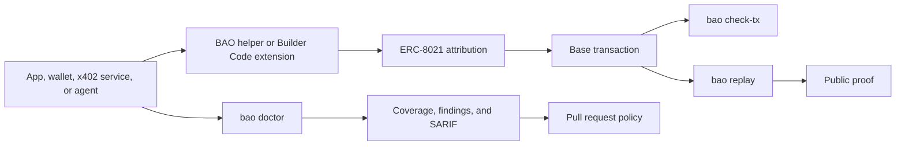

# Base Attribution OS

[](https://www.npmjs.com/package/@base-attribution-os/core)
[](https://github.com/horn111/base-attribution-os/actions/workflows/ci.yml)
[](package.json)
[](LICENSE)

**Attribution infrastructure for Base builders.**

Base Attribution OS adds ERC-8021 Builder Code attribution to transaction code,
audits supported transaction paths, verifies calldata and onchain results, and
enforces coverage in CI.

[Live demo](https://base-attribution-os.vercel.app) ·
[Attribution Observatory](https://base-attribution-os.vercel.app/observatory) ·
[Published proof](https://base-attribution-os.vercel.app/proof/bc_vwmzy653) ·
[v0.1.0 release](https://github.com/horn111/base-attribution-os/releases/tag/v0.1.0) ·
[npm packages](https://www.npmjs.com/org/base-attribution-os) ·
[Documentation](docs/attribution-doctor.md)


```mermaid
flowchart LR
  A["App, wallet, x402 service, or agent"] --> B["BAO helper or Builder Code extension"]
  B --> C["ERC-8021 attribution"]
  C --> D["Base transaction"]
  A --> E["bao doctor"]
  E --> F["Coverage, findings, and SARIF"]
  F --> G["Pull request policy"]
  D --> H["bao check-tx"]
  D --> I["bao replay"]
  I --> J["Public proof"]
```

## One policy from source code to onchain proof

Builder Code attribution can disappear in a refactor without breaking the
transaction. BAO gives teams a repeatable control at each stage of the path.

| Stage     | BAO capability                                                       |
| --------- | -------------------------------------------------------------------- |
| Integrate | Typed helpers for viem, wagmi, and ethers                            |
| Audit     | AST-backed analysis for supported TypeScript transaction paths       |
| Verify    | ERC-8021 encode, decode, calldata, and Base transaction checks       |
| Enforce   | GitHub Action annotations, changed-only checks, baselines, and SARIF |

BAO also recognizes attribution patterns around Privy, raw RPC calls, smart
wallet batches, agent transaction tools, and x402 Builder Code extensions.

## Quickstart

Install the adapter for your transaction client and the CLI:

```bash
pnpm add @base-attribution-os/viem
pnpm add -D @base-attribution-os/cli
```

Create a project policy and run the first audit:

```bash
pnpm exec bao init --builder-code bc_abc123
pnpm exec bao doctor
```

`bao init` creates `bao.config.json`. Commit that file so local development and
CI use the same Builder Codes, paths, profile, and severity rules.

Replace `bc_abc123` with a Builder Code registered for your project.

## Add attribution

### viem

```ts
import { builderCodeDataSuffix } from "@base-attribution-os/viem";

const dataSuffix = builderCodeDataSuffix("bc_abc123");

await walletClient.sendTransaction({
  account,
  to,
  value,
  data: "0x",
  dataSuffix,
});
```

<details>
<summary><strong>wagmi</strong></summary>

```tsx
import { useAttributionSuffix } from "@base-attribution-os/wagmi";

const dataSuffix = useAttributionSuffix({ codes: ["bc_abc123"] });

writeContract({
  address,
  abi,
  functionName: "mint",
  args: [],
  dataSuffix,
});
```

</details>

<details>
<summary><strong>ethers</strong></summary>

```ts
import { withEthersAttribution } from "@base-attribution-os/ethers";

await signer.sendTransaction(
  withEthersAttribution({ to, value, data: "0x" }, { codes: ["bc_abc123"] }),
);
```

</details>

More integration patterns: [docs/integrations.md](docs/integrations.md).

## Enforce attribution in pull requests

```yaml
name: Validate Attribution

on:
  pull_request:

permissions:
  contents: read
  security-events: write

jobs:
  attribution:
    runs-on: ubuntu-latest
    steps:
      - uses: actions/checkout@v5
        with:
          fetch-depth: 0

      - uses: horn111/base-attribution-os/packages/github-action@v0
        with:
          builder-code: bc_abc123
          profile: ci
          changed-only: "true"
          base-ref: ${{ github.event.pull_request.base.sha }}
          sarif-output: bao-results.sarif

      - uses: github/codeql-action/upload-sarif@v4
        if: ${{ always() && hashFiles('bao-results.sarif') != '' }}
        with:
          sarif_file: bao-results.sarif
```

The Action reports checked files, detected transaction paths, protected paths,
coverage, and findings. The `v0` tag follows the current compatible v0 release;
pin `v0.1.0` when your workflow requires an immutable ref.

## Attribution Doctor

Attribution Doctor maps each supported call site to its attribution evidence,
rule ID, confidence, and suggested fix.

```bash
pnpm exec bao doctor
pnpm exec bao doctor --changed-since origin/main
pnpm exec bao doctor --format sarif --output bao-results.sarif
pnpm exec bao doctor --write-baseline .bao-baseline.json
```

Choose enforcement per environment:

| Profile  | Policy                                                                |
| -------- | --------------------------------------------------------------------- |
| `local`  | Report findings without blocking integration work                     |
| `ci`     | Fail clear missing or incorrect attribution; warn on dynamic evidence |
| `strict` | Require evidence that matches a configured Builder Code               |

Rule IDs separate missing attribution (`BAO001`), incorrect codes (`BAO002`),
dynamic configuration (`BAO003`), smart-wallet capability gaps (`BAO005`), and
x402 extension gaps (`BAO006`).

Read the full workflow in
[docs/attribution-doctor.md](docs/attribution-doctor.md).

## Verify calldata and transactions

```bash
pnpm exec bao encode --code bc_abc123
pnpm exec bao decode --calldata 0x...
pnpm exec bao check-calldata --calldata 0x... --expect bc_abc123
pnpm exec bao check-tx \
  --hash 0x... \
  --rpc-url https://mainnet.base.org \
  --expect bc_abc123
```

BAO has a verified Base mainnet proof transaction for its own Builder Code.
See [docs/onchain-proof.md](docs/onchain-proof.md) for the transaction hash and
the matching `bao check-tx` result.

Do not copy BAO's proof code into another project. Register and use your own
Builder Code.

## Replay and publish attribution proofs

Turn a Dune export or a list of transaction hashes into a reproducible coverage
report:

```bash
pnpm exec bao replay \
  --builder-code bc_abc123 \
  --input dune-export.csv

pnpm exec bao proof \
  --hash 0x... \
  --rpc-url https://mainnet.base.org \
  --expect bc_abc123 \
  --output proof.md
```

Use the included [Dune query templates](dune/) to find attributed Base
transactions. The [Attribution Proof Loop guide](docs/attribution-proof-loop.md)
documents JSON and CSV inputs, RPC replay, report statuses, and publication
safety. Explore the workflow in the
[Attribution Observatory](https://base-attribution-os.vercel.app/observatory)
and inspect BAO's
[published proof](https://base-attribution-os.vercel.app/proof/bc_vwmzy653).

## Packages

All seven public packages ship at `0.1.0`.

| Package                                                                                                  | Role                                            |
| -------------------------------------------------------------------------------------------------------- | ----------------------------------------------- |
| [`@base-attribution-os/core`](https://www.npmjs.com/package/@base-attribution-os/core)                   | ERC-8021 encode, decode, validation, and replay |
| [`@base-attribution-os/viem`](https://www.npmjs.com/package/@base-attribution-os/viem)                   | viem `dataSuffix` and client helpers            |
| [`@base-attribution-os/wagmi`](https://www.npmjs.com/package/@base-attribution-os/wagmi)                 | wagmi config and React hook helpers             |
| [`@base-attribution-os/ethers`](https://www.npmjs.com/package/@base-attribution-os/ethers)               | ethers transaction and signer helpers           |
| [`@base-attribution-os/scanner`](https://www.npmjs.com/package/@base-attribution-os/scanner)             | AST rules, configuration, baselines, and SARIF  |
| [`@base-attribution-os/cli`](https://www.npmjs.com/package/@base-attribution-os/cli)                     | `bao` audit, replay, and proof commands         |
| [`@base-attribution-os/github-action`](https://www.npmjs.com/package/@base-attribution-os/github-action) | CI annotations, summaries, outputs, and SARIF   |

The release verification script builds and packs all seven packages, installs
their tarballs into a clean consumer project, compares adapter output, and runs
the CLI smoke suite.

```bash
pnpm verify:release-candidate
```

## Supported surfaces

The scanner covers known TypeScript patterns across:

- viem, wagmi, and ethers transaction calls;
- Privy, raw RPC, and smart-wallet flows;
- wallet `sendCalls` and batched calldata;
- agent transaction tools;
- x402 buyer and resource-server Builder Code extensions.

BAO performs static analysis. It does not hold keys, submit transactions,
execute x402 payments, or replace the official Builder Code validation tool.
Use that checker for a transaction that already exists; use BAO to protect the
code path before deploy and verify the result afterward.

## Documentation

| Guide                                                      | Purpose                                        |
| ---------------------------------------------------------- | ---------------------------------------------- |
| [Builder Codes primer](docs/builder-codes-primer.md)       | ERC-8021 and Builder Code fundamentals         |
| [Configuration](docs/configuration.md)                     | `bao.config.json`, profiles, and rule severity |
| [Integrations](docs/integrations.md)                       | viem, wagmi, ethers, wallets, and agents       |
| [CI validation](docs/ci-validation.md)                     | GitHub Action setup and changed-only scans     |
| [x402 Builder Codes](docs/x402-builder-codes.md)           | Buyer and resource-server extension checks     |
| [SARIF and code scanning](docs/sarif-and-code-scanning.md) | GitHub code scanning output                    |
| [Incremental adoption](docs/incremental-adoption.md)       | Baselines for existing attribution debt        |
| [Architecture](docs/architecture.md)                       | Package boundaries and trust model             |
| [Attribution Proof Loop](docs/attribution-proof-loop.md)   | Dune and RPC replay with public proof reports  |
| [Roadmap](docs/roadmap.md)                                 | Shipped work and planned milestones            |

Primary references:

- [Base Builder Codes](https://docs.base.org/apps/builder-codes/builder-codes)
- [Base app integration](https://docs.base.org/apps/builder-codes/app-developers)
- [Base wallet integration](https://docs.base.org/apps/builder-codes/wallet-developers)
- [Base agent integration](https://docs.base.org/apps/builder-codes/agent-developers)
- [x402 Builder Code extension](https://github.com/x402-foundation/x402/blob/main/typescript/packages/extensions/src/builder-code/README.md)
- [Dune EIP-8021 parser](https://docs.dune.com/query-engine/Functions-and-operators/eip-8021)
- [Builder Code Validation](https://builder-code-checker.vercel.app/)

## Contributing

Read [CONTRIBUTING.md](CONTRIBUTING.md), open an
[issue](https://github.com/horn111/base-attribution-os/issues), or submit a
focused pull request with a fixture and test.

## License and independence

MIT licensed. Built by [horn111](https://github.com/horn111) as an independent
open-source project for the Base ecosystem. Base Attribution OS is not
affiliated with Coinbase or Base.
