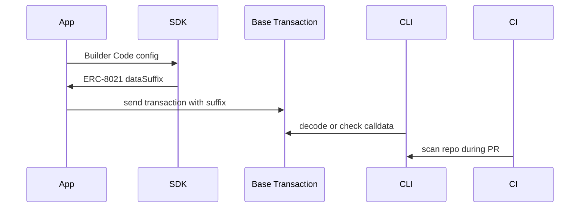

# Architecture

Base Attribution OS is a thin orchestration layer. It avoids becoming a hosted
platform in the MVP and focuses on code that developers can run locally, in
apps, and in CI.

## Layers

- Core: ERC-8021 suffix encode, decode, append, and validate.
- Adapters: tiny helpers for viem, wagmi, and ethers transaction flows.
- CLI: local validation for calldata, transaction hashes, and repository scans.
- GitHub Action: CI wrapper around `bao scan-repo`.
- Examples: reference integrations for apps, wallets, agents, and x402 payment
  paths.

## Data flow

## Boundaries

The MVP does not make reward eligibility decisions, operate a hosted dashboard,
or replace Base.dev. It helps teams ship attribution correctly and prove that it
is present.

Scanner profiles define how strongly repository scans should enforce attribution:

- `local`: surface findings without blocking integration work by default.
- `ci`: fail obvious missing or wrong Builder Code usage.
- `strict`: require the expected Builder Code or suffix inside candidate files.
