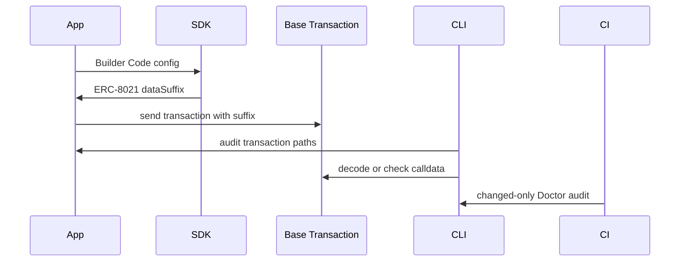

# Architecture

Base Attribution OS is a thin orchestration layer. It avoids becoming a hosted
platform in the MVP and focuses on code that developers can run locally, in
apps, and in CI.

## Layers

- Core: ERC-8021 suffix encode, decode, append, and validate.
- Adapters: tiny helpers for viem, wagmi, and ethers transaction flows.
- Scanner: AST-backed transaction discovery, rule evaluation, baselines, and
  SARIF output.
- CLI: `bao doctor`, config initialization, calldata, transaction, and
  compatibility scan commands.
- GitHub Action: annotations and coverage summaries around the Doctor report.
- Examples: reference integrations for apps, wallets, agents, and x402 payment
  paths.

## Data flow

```mermaid
sequenceDiagram
  participant App
  participant SDK
  participant Tx as Base Transaction
  participant CLI
  participant CI

  App->>SDK: Builder Code config
  SDK->>App: ERC-8021 dataSuffix
  App->>Tx: send transaction with suffix
  CLI->>App: audit transaction paths
  CLI->>Tx: decode or check calldata
  CI->>CLI: changed-only Doctor audit
```

## Boundaries

The MVP does not make reward eligibility decisions, operate a hosted dashboard,
or replace Base.dev. It helps teams ship attribution correctly and prove that it
is present.

Scanner profiles define how strongly repository scans should enforce attribution:

- `local`: surface findings without blocking integration work by default.
- `ci`: fail missing or wrong Builder Codes and warn on dynamic evidence.
- `strict`: require every path to match verifiable attribution evidence.

The AST layer is intentionally static. It recognizes project-level SDK config
and direct call-site evidence, but does not execute environment-dependent code.
